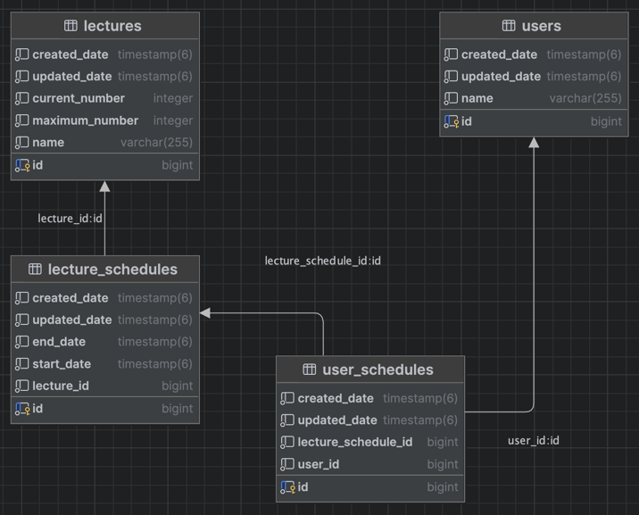

# Tables
- lectures: 강의 정보
- lecture_schedules: 강의의 일정 정보
- user_schedules: 유저가 등록한 강의 정보
- users : 유저 정보

1. 강의 하나당 여러번의 강의를 할 수 있기에 강의 정보와 강의 일정을 분리했습니다.
2. 유저가 여러 강의를 등록할 수 있기에 유저와 유저 일정을 분리했습니다.